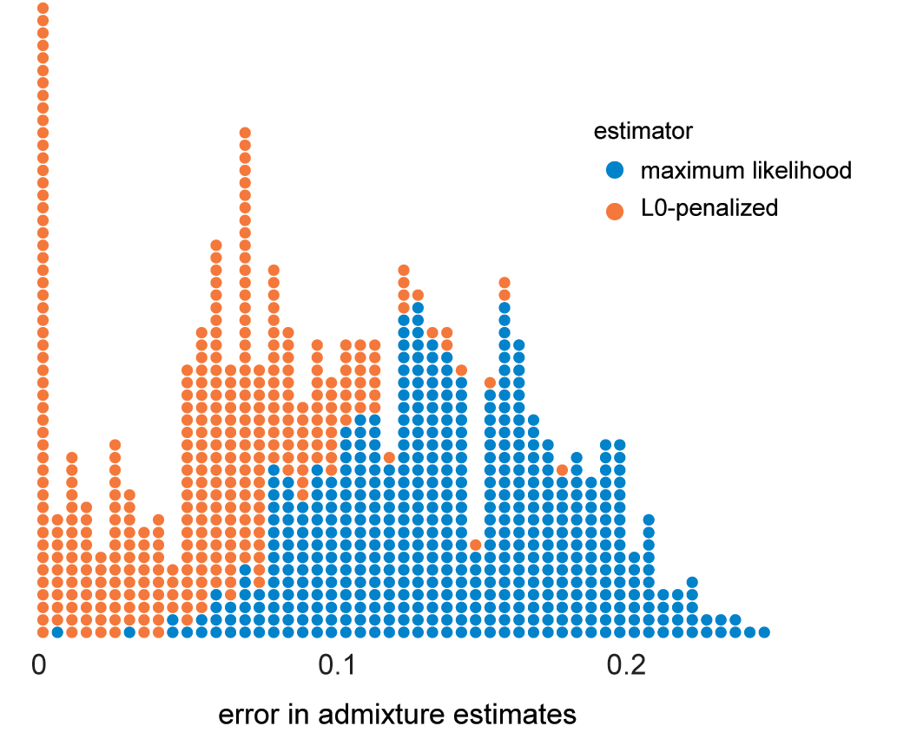

# admixture

*A simple EM implementation of the
[ADMIXTURE](http://dx.doi.org/10.1101/gr.094052.109) model in
R, plus extensions.*

The ADMIXTURE
[software](https://www.genetics.ucla.edu/software/admixture/) is
widely used to estimate population structure from genotype data in
part because the computation scales well to whole-genome genotype
data. For example, the million+ people who have taken the AncestryDNA
test have all received their [ethnicity
estimate](http://dna.ancestry.com/resource/whitePaper/AncestryDNA-Ethnicity-White-Paper)
from ADMIXTURE.

I have developed a simple, alternative implementation of ADMIXTURE
that computes maximum-likelihood estimates of the admixture
proportions and population allele frequencies using the expectation
maximization (EM) algorithm. (See
[admixture.barebones.R](R/admixture.barebones.R) and
[admixture.barebones.demo.R](R/admixture.barebones.demo.R) for a
extremely simple, or "bare bones", implementation that actually works,
albeit slowly!)

The ADMIXTURE software is implemented using a quasi-Newton method, and
will typically converge much more quickly to a solution than the EM
algorithm. I've modified the model to allow for genotype errors, and
this seems to help convergence to some extent. In any case, the hope
is that this very simple implementation will facilitate development of
extensions to ADMIXTURE. One extension I have developed here is a
modification to the optimization (M-step) that encourages *sparse*
admixture estimates.

This code was tested using R version 3.2.2.

The admixture source code repository is free software: you can
redistribute it under the terms of the **MIT license**. All the files
in this project are part of **admixture**. This project is distributed
in the hope that it will be useful, but **without any warranty**;
without even the implied warranty of **merchantability or fitness for
a particular purpose**. See file [LICENSE](LICENSE) for the full text
of the license.

[Peter Carbonetto](http://www.cs.ubc.ca/spider/pcarbo) 
[AncestryDNA](http://dna.ancestry.com) 
San Francisco, California

### Getting started

Before using any of the functions in R, build the the shared object
(.so) files with the following commands:

    R CMD SHLIB mcmc.c
    R CMD SHLIB admixture.c

I have written two scripts to demonstrate usage of the EM algorithm.

Script **example.admixture.R** uses the EM algorithm
(**admixture.em**) to predict admixture proportions when we have a
reference set of labeled, single-origin individuals.

Script **example.sim.R** evaluates accuracy of the admixture estimates
in simulated genotype data, with and without the L0-penalty term that
encourages sparsity in the admixture proportions. In this example, all
the samples are unlabeled.

### The admixture.em function

Estimate admixture proportions in unlabeled samples from their
genotypes.

#### Usage

    admixture.em(X, K, z = NULL, e = 0.001, a = 0, F = NULL, Q = NULL,
    			 tolerance = 1e-4, max.iter = 1000, exact.q = FALSE,	
                 cg = FALSE,mc.cores = 1, verbose = TRUE, T = 1)

#### Arguments
				 
Input **X** is an n x p genotype matrix, where n is the number of
samples and p is the number of biallic genetic markers. Genotypes are
represented as allele counts, so all entries must be 0, 1 or
2. Missing values (NA) are also allowed.

Input **K** is a model parameter specifying the number of ancestral
populations.

Input **z** is a vector giving the population of origin (an integer
between 1 and K) for each of the samples, or NA is the sample is
unlabeled. If z is set to NULL, or is not specified, all samples are
treated as unlabeled.

Input **e** specifies the probably of a genotype error. It must be a
positive number. It can be small (e.g., 1e-6), but note that small
values tend to increase convergence time of the EM algorithm.

Input **a** specifies the strength of the L0-penalty term that
encourages sparsity in the admixture estimates. By default, a = 0,
which means that the L0-penalty term has no effect, and the
maximum-likelihood estimate is returned. I have implemented a
procedure for choosing the L0-penalty strength using cross-validation,
but this procedure isn't demonstrated yet in this code. For some
details on this cross-validation, see function
**calc.geno.error.R**.

Inputs **F** and **Q** are the initial estimates of the population
allele frequencies and admixture proportions, respectively. If these
inputs aren't specified, these model parameters are randomly
initialized. For more details on F and Q, see below.

Input argument **tolerance** specifies the convergence tolerance of
the EM iterates. Convergence is reached when the maximum absolute
difference between the parameters at two successive iterations is less
than the specified tolerance. Input **max.iter** specifies the maximum
number of EM iterations.

There are two variations to the M-step update for Q. When the number
of ancestral populations is small (e.g., K < 20), it is feasible to
compute the optimal solution exactly by exhaustively calculating the
posterior probability for each possible choice of nonzero admixture
proportions.  Setting **exact.q = TRUE** activates this
option. However, for larger K, it is not feasible to compute the exact
solution because the number of ways of choosing nonzero admixture
proportions is too large. Instead, setting **exact.q = FALSE**
computes an approximate solution using simulated annealing. In this
case, it is necessary to set input **T**. For an explanation of T, see
function **update.q.sparse.approx**.

The **cg** parameter controls the M-step update for the F matrix. When
cg = FALSE, the allele frequencies are updated using the standard
M-step solution. When cg = TRUE, the standard M-step update is
adjusted using conjugate gradient with the Hestenes-Stiefel update
formula. I've found that this sometimes improves convergence of the EM
iterates.

Finally, **mc.cores** is the input to mclapply specifying the number
of cores to use in the multicore versions of the E and M-steps.

#### Value

The return value is a list with two elements:

**F**, the p x K matrix of population-specific allele frequency
estimates;

**Q**, the n x K matrix of admixture proportions, where n is the
number of individuals (samples). For labeled samples, the admixture
proportions are Q[i,k] = 1 for z[i] = k.

### Sample output from running example.admixture.R

The R console output should look something like this:

    > source("example.admixture.R")
    Simulating data with the following settings:
    markers               200
    ancestral populations 20
    training samples      100
	test samples          300
	Generating genotype data for single-origin training samples.
	Generating genotype data for test samples.
	Setting 1% of the genotypes to NA.
	Computing maximum-likelihood admixture proportion estimates.
	iter delta-F delta-Q -beta-
	431 9.8e-05 6.7e-05 00.484
	Computation took 0.6 min.
	Computing L0-penalized admixture proportion estimates.
	iter delta-F delta-Q -beta-
	 119 9.9e-05 3.0e-05 00.473
	Computation took 0.2 min.
	Overlap between estimated and ground-truth admixture proportions:
	   0 0.1 0.2 0.3 0.4 0.5 0.6 0.7 0.8 0.85 0.9 0.95
	ML 0   0   0   1   1  11  26  74  52   61  37   37
	L0 0   0   1   0   6   1  13  44  18   36  42  139

	Number of contributing ancestral populations (>1%):
	    ML
	true  1  2  3  4  5  6  7  8  9 10 11 12
	   1 19 32 25 13  7  2  2  0  0  0  0  0
	   2  0  4 10 22 34 18  5  6  0  1  0  0
	   4  0  0  0  0  6 15 25 24 15  9  3  3
	   
	    L0
	true  1  2  3  4  5
	   1 96  4  0  0  0
	   2  0 81 19  0  0
	   4  1  2 35 47 15

### Sample output from running example.sim.R

The R console output should look something like this:

    > source("example.sim.R")
    Loading allele frequency data.
    Generating population allele frequencies.
    Generating data.
    Fitting admixture model to data.
    iter delta-F delta-Q -beta-
    510 4.8e-04 4.1e-04 00.489
    Computation took 1.8 min.
    Fitting L0-penalized admixture model to data.
    iter delta-F delta-Q -beta-
    153 3.0e-04 4.5e-04 -0.112
    Computation took 1.2 min.

    Overlap between estimated and ground-truth admixture proportions:
    0 0.1 0.2 0.3 0.4 0.5 0.6 0.7 0.8 0.85 0.9 0.95
	ML 0   0   0   0   0   0   0  53 170  197  76    4
	L0 0   0   0   0   0   0   0   0   4   38 189  269

	Number of contributing ancestral populations (>1%):
	       1   2  3   4   5   6  7  8 9 10
	true 254 246  0   0   0   0  0  0 0  0
	ML     1   2 38 105 143 118 57 27 9  0
	L0   186 217 84  12   1   0  0  0 0  0
			
